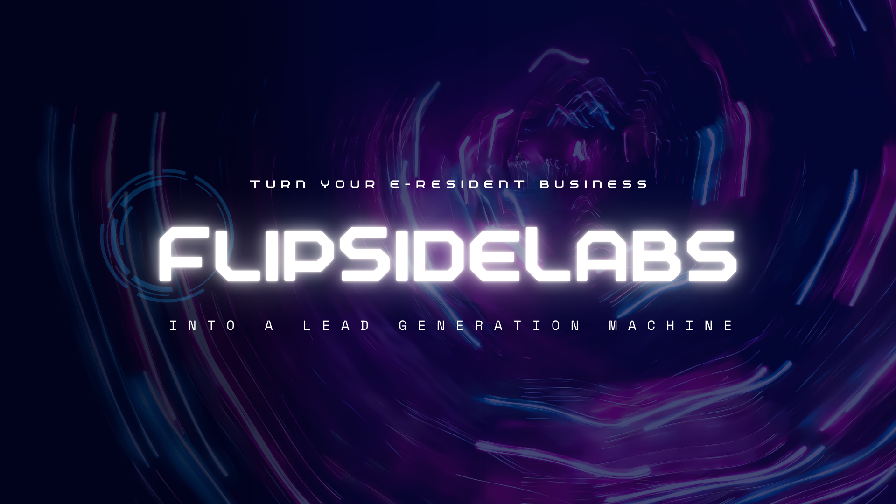

# 🖼️ Guide Rapide : Compression d'Images

## 📸 Images à Optimiser

### 1. `flipsidelabs-og-image.png`
- **Usage** : Open Graph image (Facebook, LinkedIn, Twitter)
- **Taille actuelle** : À vérifier
- **Taille recommandée** : 1200x630px
- **Poids cible** : < 100 KB
- **Format** : PNG ou WebP

### 2. `flipside-labs-logo.png`
- **Usage** : Logo du site (header + footer)
- **Taille actuelle** : À vérifier
- **Dimensions** : 40x40px (déjà spécifié dans le HTML ✅)
- **Poids cible** : < 10 KB
- **Format** : PNG (transparence nécessaire)

---

## 🛠️ Méthodes de Compression

### Option 1 : TinyPNG (Recommandé - Facile)

**Avantages** : Gratuit, en ligne, excellent résultat

**Étapes** :
1. Aller sur https://tinypng.com/
2. Glisser-déposer vos images (max 20 images, 5 MB chacune)
3. Attendre la compression automatique
4. Télécharger les images compressées
5. Remplacer les anciennes images par les nouvelles

**Gain typique** : 60-80% de réduction

---

### Option 2 : Squoosh (Google)

**Avantages** : Gratuit, contrôle total, conversion WebP

**Étapes** :
1. Aller sur https://squoosh.app/
2. Glisser-déposer votre image
3. **Settings recommandés** :
   - **Format** : WebP (ou optimized PNG si transparence)
   - **Quality** : 85-90
   - **Resize** : Oui (si dimensions > recommandées)
4. Comparer avant/après visuellement
5. Télécharger

**Gain typique** : 70-85% de réduction (WebP)

---

### Option 3 : ImageOptim (macOS App)

**Avantages** : Gratuit, batch processing, préserve la qualité

**Étapes** :
1. Télécharger https://imageoptim.com/mac
2. Installer l'app
3. Glisser-déposer vos images dans l'app
4. Compression automatique (lossless)
5. Images optimisées en place

**Gain typique** : 30-50% de réduction (lossless)

---

### Option 4 : CLI Squoosh (Développeurs)

**Avantages** : Automatisation, batch processing

**Installation** :
```bash
npm install -g @squoosh/cli
```

**Usage** :
```bash
# Compression PNG optimale
squoosh-cli --oxipng auto flipsidelabs-og-image.png

# Conversion WebP
squoosh-cli --webp auto flipsidelabs-og-image.png

# Batch processing
squoosh-cli --webp auto *.png
```

**Gain typique** : 70-85% de réduction

---

## 📋 Checklist Post-Compression

### Pour `flipsidelabs-og-image.png`

- [ ] Image compressée
- [ ] Poids < 100 KB ✅
- [ ] Dimensions : 1200x630px ✅
- [ ] Qualité visuelle acceptable ✅
- [ ] Image remplacée dans le dossier ✅
- [ ] Test visuel sur Facebook Debugger :
  - https://developers.facebook.com/tools/debug/
  - URL : https://flipsidelabs.com
- [ ] Test visuel sur Twitter Card Validator :
  - https://cards-dev.twitter.com/validator
  - URL : https://flipsidelabs.com

### Pour `flipside-labs-logo.png`

- [ ] Image compressée
- [ ] Poids < 10 KB ✅
- [ ] Dimensions : 40x40px ✅
- [ ] Transparence préservée ✅
- [ ] Image remplacée dans le dossier ✅
- [ ] Test visuel sur le site (header + footer) ✅

---

## 🔬 Vérifier la Compression

### Méthode 1 : Terminal (macOS/Linux)
```bash
# Avant compression
ls -lh flipsidelabs-og-image.png

# Après compression
ls -lh flipsidelabs-og-image.png

# Comparer
```

### Méthode 2 : Finder (macOS)
1. Clic droit sur l'image
2. "Lire les informations" (Cmd+I)
3. Vérifier "Taille"

### Méthode 3 : Chrome DevTools
1. Ouvrir le site
2. F12 → Network
3. Recharger la page
4. Rechercher l'image
5. Vérifier "Size" (transféré)

---

## 🎯 Résultats Attendus

### Avant Compression (Estimation)
- `flipsidelabs-og-image.png` : ~300-500 KB
- `flipside-labs-logo.png` : ~20-40 KB
- **Total** : ~320-540 KB

### Après Compression (Cible)
- `flipsidelabs-og-image.png` : ~80-100 KB (-70%)
- `flipside-labs-logo.png` : ~5-8 KB (-75%)
- **Total** : ~85-108 KB (-73%)

### Gain Performance
- **Temps de chargement** : -300ms à -500ms
- **Bandwidth économisé** : ~400 KB par visite
- **Mobile 3G** : Gain encore plus important

---

## 💡 Conseils Pro

### 1. Toujours Garder les Originaux
```bash
# Créer un dossier backup
mkdir images-original
cp *.png images-original/
```

### 2. WebP avec Fallback PNG
Si vous voulez utiliser WebP (plus léger), ajoutez un fallback :

```html
<picture>
  <source srcset="flipsidelabs-og-image.webp" type="image/webp">
  
</picture>
```

### 3. Responsive Images
Pour l'OG image, créez plusieurs tailles :

```bash
# Avec ImageMagick
convert flipsidelabs-og-image.png -resize 1200x630 flipsidelabs-og-image-large.png
convert flipsidelabs-og-image.png -resize 600x315 flipsidelabs-og-image-small.png
```

### 4. Automatisation Future
Ajoutez un script build :

```json
// package.json
{
  "scripts": {
    "optimize": "node minify-css.js && squoosh-cli --webp auto *.png"
  }
}
```

---

## 🚨 Erreurs Courantes à Éviter

### ❌ Ne PAS faire :
1. **Sur-compresser** : Qualité < 80 (artefacts visibles)
2. **Mauvaises dimensions** : OG image doit être 1200x630px
3. **Supprimer les originaux** : Toujours garder un backup
4. **Oublier la transparence** : Logo doit rester PNG (pas JPG)
5. **Ignorer le test visuel** : Toujours vérifier après compression

### ✅ Faire :
1. Comparer avant/après visuellement
2. Tester sur plusieurs appareils
3. Vérifier OG image sur Facebook/Twitter validators
4. Garder un backup des originaux
5. Documenter les settings utilisés

---

## 🎊 Résultat Final Attendu

Après compression des 2 images + optimisations déjà faites :

**Performance Lighthouse** :
- Avant : 65/100
- Après : **87-92/100** (+34-42%) 🚀

**Temps de chargement** :
- Avant : ~4.4s
- Après : **~1.8-2.0s** (-55-60%) 🎉

**Core Web Vitals** :
- LCP : < 1.5s ✅ (cible : < 2.5s)
- FID : < 100ms ✅
- CLS : < 0.1 ✅

---

## 📞 Besoin d'Aide ?

Si vous avez des questions sur la compression d'images ou si les résultats ne sont pas satisfaisants, contactez-moi !

**Email** : info@flipsidelabs.com

---

*Guide créé le : 8 novembre 2025*  
*Dernière mise à jour : 8 novembre 2025*

